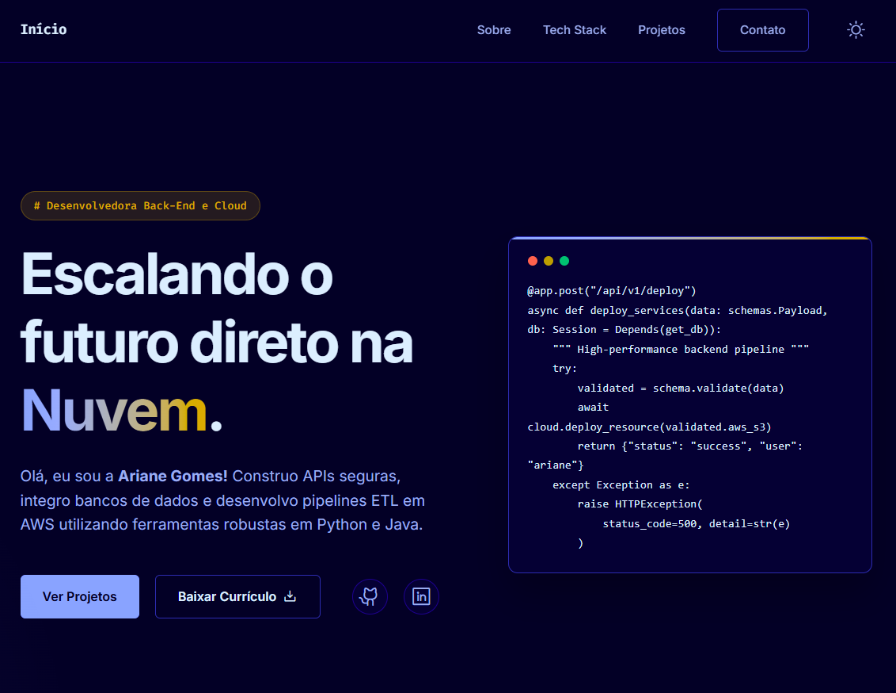
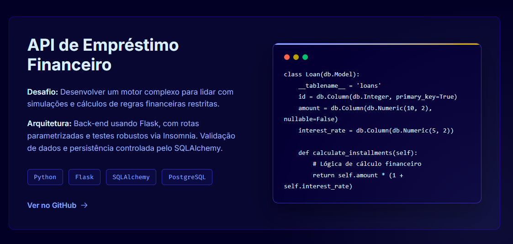

# Portfólio — Ariane Gomes

> Portfólio pessoal desenvolvido com HTML, CSS e JavaScript puros, sem frameworks.
> *Embora meu foco principal seja Back-End e Cloud, construí esta interface focando em fundamentos sólidos de engenharia: performance, acessibilidade e arquitetura limpa.*




🔗 **[arianegomesc.github.io/portfolio](https://arianegomesc.github.io/portfolio)**

---

## ✨ Destaques Técnicos

- **Sistema de cores com `oklch()`** — espaço de cor perceptualmente uniforme, muito mais previsível que HSL para criar temas dark/light consistentes via CSS custom properties
- **Efeito spotlight com cursor tracking** — variáveis CSS dinâmicas (`--mouse-x`, `--mouse-y`) atualizadas via JS para criar o efeito radial que segue o mouse, inspirado no portfólio da Brittany Chiang
- **Dark/Light mode** — tema persistido em `localStorage`, troca sem flash via classe no `<body>`, zero JS nas cores
- **Menu mobile com `transform`** — animação via `translateY` em vez de `display: none`, mantendo a performance de GPU e permitindo transições suaves
- **Mobile-First & Responsivo** — adaptação fluida baseada em Flexbox e CSS Grid sem quebras drásticas de layout
- **HTML semântico** — uso de `<article>`, `<main>`, `<header>`, `<nav>` com `aria-label` nos elementos interativos

---

## 🛠️ Tech Stack

`HTML5` `CSS3` `JavaScript` `Phosphor Icons` `Google Fonts`

---

## 📁 Estrutura

```
portfolio/
├── index.html
├── style.css
├── script.js
└── README.md
```

---

## 🚀 Como rodar localmente

Não há dependências nem build step. Basta clonar e abrir:

```bash
git clone https://github.com/arianegomesc/portfolio.git
cd portfolio
# Abra o index.html no navegador, ou use a extensão Live Server no VS Code
```

---

## 📬 Contato

- **LinkedIn:** [ariane-gomesc](https://www.linkedin.com/in/ariane-gomesc/)
- **GitHub:** [arianegomesc](https://github.com/arianegomesc)

---

<p align="center">Desenvolvido por <strong>Ariane Gomes Cunha</strong> · Fortaleza, CE · 2026</p>
